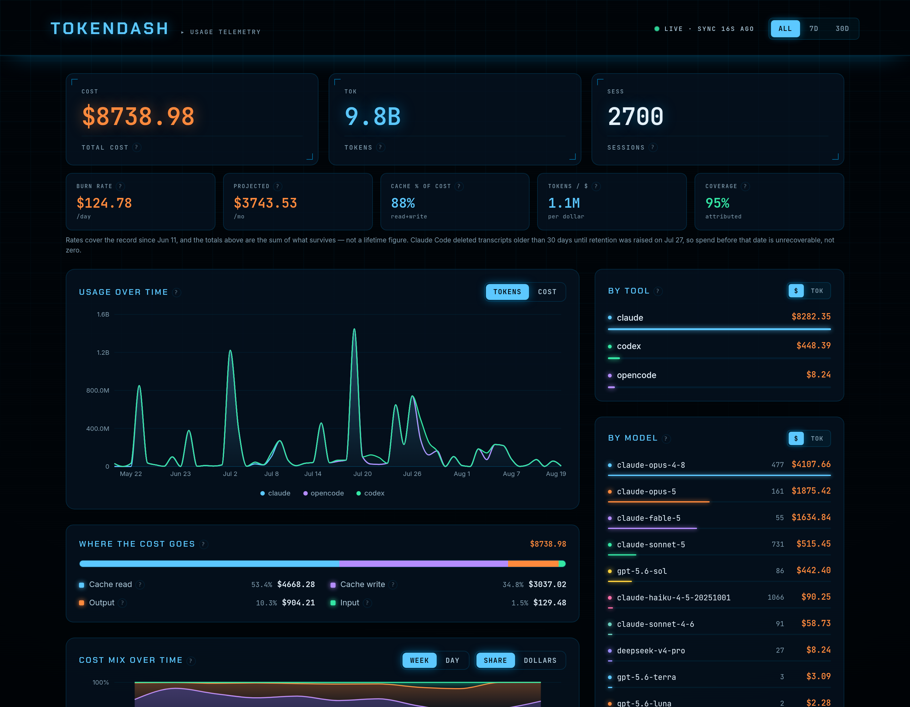

# TokenDash

A local dashboard for what your AI coding tools actually cost you.

It reads the transcripts Claude Code, Codex and opencode already write to your
disk, prices every session against published per-model rates, and serves a
single page showing where the money went. Nothing is uploaded, no API keys are
needed, and it works entirely offline — the data is already on your machine.



## Why

`ccusage` and friends tell you a total. This answers the follow-up questions:

- **Which part of the bill is cache traffic?** Usually most of it. Every turn
  re-sends the whole conversation, so a long session pays to re-read its own
  history on every single message.
- **Is that share growing?** The cost-mix panel tracks it week by week.
- **How big are my sessions getting?** The per-API-call panel plots average
  context size per request per day — the thing that drives cache cost.
- **Which projects and models are expensive?** Broken out, clickable.

Every term on the page has a `?` beside it explaining what it means, so you do
not need to already know what a cache write is.

## Requirements

- Node 20+ (developed on 24)
- At least one of: Claude Code, Codex, or opencode, with local history

## Run it

```sh
git clone https://github.com/DerekTM17/tokendash.git
cd tokendash
npm install
npm run dev          # ingests, then serves on http://localhost:5173
```

`npm run dev` runs the ingest once and starts Vite. To keep the numbers live
while you work, run the watcher alongside it:

```sh
npm run watch        # rewrites tokens.json whenever a transcript changes
```

All data lands in `packages/dashboard/public/tokens.json`, which is gitignored.
It never leaves your machine.

## What it reads

| Tool | Source |
|---|---|
| Claude Code | `~/.claude/projects/**/*.jsonl` |
| Codex | `~/.codex/sessions` |
| opencode | `~/.local/share/opencode/opencode.db` |

Pricing comes from `packages/ingest/src/pricing-data.json`, generated from
LiteLLM's public price table by `scripts/update-pricing.mjs`. Sessions whose
model has no published price are marked estimated rather than dropped.

## Two things worth knowing about the numbers

**Your history is probably shorter than you think.** Claude Code deletes
transcripts older than 30 days unless you raise `cleanupPeriodDays` in
`~/.claude/settings.json`. Whatever was swept is gone — the token counts cannot
be reconstructed from anything else on disk. The dashboard detects where its
coverage actually begins, trims the trend charts to that date, and says so
rather than drawing the missing months as zero spend. **Raise that setting
before you start caring about the history.**

**Subagents are counted separately.** A dispatched subagent gets its own context
and its own bill, so it appears as its own session rather than folded into its
parent.

## Driver decomposition and interventions

Two panels answer "why did my bill move" rather than "how much was it."

**Driver decomposition** multiplies cost out into five factors — active days x
turns per active day x requests per turn x tokens per request x price per
token — so a change in the total can be pinned on one of them instead of
argued about qualitatively. A "turn" is a real prompt, not a tool result (see
`AGENTS.md` for how that distinction is made), and everything is day-sliced
the same way the per-call panel is, so a session spanning a week does not get
its whole cost credited to the day it started. `Tokens/Request` here counts
all four token buckets — input, output, cacheRead, cacheWrite — because the
factors have to multiply back out to the same cost the rest of the dashboard
shows. That is a different measure from the per-call context panel above,
which deliberately excludes output; see `AGENTS.md`.

**Interventions** answer "did that change actually work?" You declare a
change before it happens: copy `interventions.example.json` to
`interventions.json` at the repo root and write down the date, a label, and
the one factor you expect it to move. `interventions.json` is gitignored and
never leaves your machine. Declaring `expect` before looking at the result is
the whole mechanism — with five factors and two directions there are ten ways
to find a flattering number after the fact, and a factor picked once you have
already seen the outcome proves nothing. Re-run ingest and the panel compares
matched before/after windows, checks whether something else moved at the same
time that could explain the shift instead (model mix, project mix, subagent
share, cache mix), and reports a verdict — supported, not supported,
confounded, underpowered, provisional, pending, or refused — with the
reasoning spelled out rather than just a number. Once a before-window ages
out of the 30-day retention sweep a verdict can no longer be recomputed, so a
matured result can be hand-frozen into `interventions.results.json` (also
gitignored) to keep the record past that point.

## Optional: the session boundary detector

`packages/hooks` is a separate, opt-in piece: a `UserPromptSubmit` hook that
watches how large your Claude Code context has grown and tells you when starting
a fresh session would be cheaper than continuing — with the arithmetic attached,
including how many turns the switch takes to pay for itself.

It fires at most twice per session (once at 325k tokens, once at 450k) and stays
silent otherwise. Wire it up by adding to `~/.claude/settings.json`:

```json
{
  "hooks": {
    "UserPromptSubmit": [
      { "hooks": [ { "type": "command",
        "command": "node /absolute/path/to/tokendash/packages/hooks/context-boundary.mjs" } ] }
    ]
  },
  "statusLine": {
    "type": "command",
    "command": "node /absolute/path/to/tokendash/packages/statusline/statusline.mjs"
  }
}
```

The status line is what measures context size, so the hook needs it to be useful.
Thresholds are tunable with `CTX_ARM_TOKENS` / `CTX_CEILING_TOKENS`.

## Keeping it running

`scripts/autostart.sh` starts both the watcher and the server, and is safe to run
repeatedly — use it from cron to survive reboots and self-heal after a crash:

```sh
(crontab -l 2>/dev/null;
 echo "@reboot $PWD/scripts/autostart.sh";
 echo "*/10 * * * * $PWD/scripts/autostart.sh") | crontab -
```

## Tests

```sh
npm test             # ingest + hooks + threshold gate + dashboard
```

A passing suite is not proof the parsers are right — they feed on real files
whose formats are undocumented and change. See `AGENTS.md` for how to verify
ingest output against actual data before trusting it.

## License

MIT — see [LICENSE](LICENSE).
